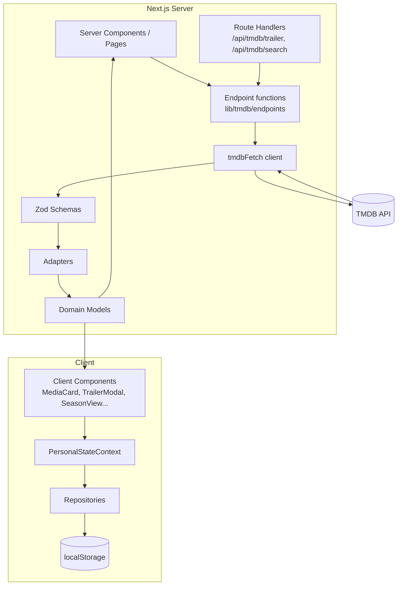

# Pineapple TV

A movie & TV discovery and personal tracking platform built with Next.js 14 (App Router), TypeScript, and the TMDB API. Pineapple TV is not a streaming service — it does not host or distribute content. All metadata, imagery, and trailers come from [TMDB](https://www.themoviedb.org/) and YouTube; the application is a personal discovery and tracking layer on top of that data.

---

## Overview

Pineapple TV lets you browse trending and popular movies and TV shows, search across both media types, filter discovery results by genre/year/rating, and inspect rich detail pages (cast, crew, keywords, watch providers, recommendations, trailers). A personal library — watchlist, favorites, watched movies, 5-star ratings, and per-episode TV progress — is tracked entirely in the browser and surfaced through a stats dashboard and a continue-watching view.

The engineering focus is on a strict boundary between the external TMDB API and the application domain: every TMDB response is validated at runtime and normalized before any UI component sees it, and the TMDB API token never leaves the server.

---

## Key Features

### Media Discovery
- Trending today, popular/top-rated/upcoming/now-playing movies, popular/top-rated/airing-today/on-the-air TV
- Debounced multi-entity search with All / Movies / TV tabs, pagination, and URL-persisted state
- Discover pages with genre, year, minimum-rating, and sort filters, fully encoded in the URL for shareable/bookmarkable views
- Recommendations and similar titles on every detail page

### Media Details
- Hero backdrops, metadata (runtime, release date, ratings), taglines, and genre chips
- Top cast and filtered key crew (director, writers, composers)
- Keywords and US watch providers (streaming / rent / buy)
- Trailer playback via an accessible modal with graceful fallbacks

### Personal Library
- Watchlist and favorites toggles on cards and detail pages (`aria-pressed` toggle buttons)
- Watched-movie tracking and 5-star ratings
- Episode-level watched tracking per season with progress bars and an "unwatched only" filter
- Dashboard with stats (movies watched, shows tracked, episodes watched, average rating), continue-watching deep links, and a capped recent-activity feed
- Settings page with theme switcher, local data summary, and a clear-all-data action

### User Experience
- Dark-first cinematic theme with a light mode, driven by a design-token system
- Skeleton loading states for pages and grids, dedicated empty and error states
- Responsive layout with a desktop sidebar and mobile bottom navigation


---

## Architecture

The application follows a layered architecture. Server Components and Route Handlers own all TMDB communication; client components own interactivity and personal state. The TMDB token is only ever read in server code.



### Data Flow

External data follows a single, unidirectional path:

```
TMDB API
  → tmdbFetch (server-only fetch wrapper, revalidation via Next.js fetch cache)
  → Zod schema validation
  → Adapters
  → Domain models (lib/domain/models.ts)
  → Server Components / Route Handlers
  → UI components
```

TMDB response shapes (`title` vs `name`, `release_date` vs `first_air_date`, snake_case keys, frequently-null fields) never leak into UI components. Components consume typed domain models (`MediaSummary`, `Movie`, `TVShow`, `Episode`, `Video`) with camelCase keys and guaranteed shapes. When TMDB changes its payload, only the schema/adapter pair needs updating.

### Server/Client Component Boundaries

- Pages (`app/page.tsx`, `movies/[id]`, `tv/[id]`, discover pages) are async Server Components that fetch and adapt data server-side
- Detail views (`MovieDetail`, `TVDetail`, `SeasonView`), the trailer modal, personal-state actions, and the search page are Client Components receiving already-normalized data via props
- Two Route Handlers (`/api/tmdb/trailer`, `/api/tmdb/search`) proxy the only client-initiated TMDB requests


---

## Project Structure

```
app/
├── api/tmdb/            Route handlers: trailer lookup, search proxy
├── movies/              /movies, /movies/discover, /movies/[id] (+ loading.tsx)
├── tv/                  /tv, /tv/discover, /tv/[id], /tv/[id]/season/[seasonNumber]
├── search/              Client search page (Suspense boundary around useSearchParams)
├── watchlist/ favorites/ dashboard/ settings/   Personal pages (noindex layouts)
├── layout.tsx           Root metadata, providers (Query, Theme, PersonalState), AppShell
├── sitemap.ts robots.ts not-found.tsx
components/
├── media/               MediaCard, MediaGrid, MediaRow, MediaHero, MediaDetailHero,
│                        TrailerModal, PersonCard, CastSection, CrewSection,
│                        MediaCollection, WatchProviders, Keywords
├── movie/ tv/           MovieDetail; TVDetail, SeasonView, SeasonSelector
├── layout/              AppShell, Header, Sidebar, MobileNavigation, Footer
├── discover/ home/      FilterBar; Hero
└── ui/                  MediaActions (watchlist/favorite/watched/rating), Skeleton, States
lib/
├── domain/              Framework-agnostic domain models
├── tmdb/                client, endpoints, schemas (Zod), adapters, trailer, image-config
├── repositories/        Watchlist, Favorites (shared SavedMediaRepository), Watched, Ratings, Activity + types
├── storage/             StorageAdapter interface + localStorage implementation
├── state/               PersonalStateContext (React context over repositories)
├── queries/             TanStack Query provider and centralized query keys
├── discover/            URL ⇄ filter-state ⇄ TMDB params mapping
└── theme/ utils/
tests/                   Vitest unit and component tests
```


---

## TMDB Integration

### Server-side API Client

`lib/tmdb/client.ts` is the single fetch wrapper. It reads `TMDB_API_TOKEN` from the environment, applies Bearer authorization, sets a default `language`, and configures Next.js fetch caching with per-endpoint `revalidate` values and cache tags. Failures raise a typed `TmdbError` carrying the HTTP status, with an explicit message for 429 rate limiting. The token is only referenced in server-executed modules.

### Runtime Validation

Every TMDB response shape used by the application has a Zod schema in `lib/tmdb/schemas.ts`. The schemas are deliberately lenient — TMDB omits and nulls fields unpredictably, so descriptive fields are optional with defaults — but load-bearing fields are strict: a video response without a `key` fails validation rather than producing a broken embed. Unknown extra fields are stripped, so only consumed data crosses the boundary.

### Data Normalization

Adapters in `lib/tmdb/adapters.ts` transform validated payloads into domain models. They handle the movie/TV field asymmetry (`title`/`name`, `release_date`/`first_air_date`), derive `year` from release dates, extract the director from crew credits, filter unsupported result types (e.g., `person` results in multi-search), normalize explicit nulls that Zod defaults don't cover, and cap keyword lists.

### Caching

Revalidation is tuned per endpoint:

| Data | Revalidate |
|------|-----------|
| Discover / search results | 600s |
| Trending / home rows / detail payloads | 1800–3600s |
| Top-rated lists | 7200s |
| Credits, videos, recommendations, similar, providers, keywords, seasons | 86400s |
| Trailer route handler (`export const revalidate`) | 86400s |

Route-level `revalidate` exports additionally control page caching (home: 1800s, detail pages: 3600s).


---

## Trailer Architecture

Trailer handling is a dedicated subsystem shared between the API route and detail pages via `lib/tmdb/trailer.ts`:

- **Selection (`pickTrailer`)**: filters to YouTube videos with non-empty keys; prefers Trailers over Teasers (clips and featurettes are never selected); ranks official before unofficial; breaks ties by newest `published_at`. A missing trailer is a legitimate data state — `pickTrailer` returns `null` and no key is ever fabricated.
- **URL building**: `buildTrailerEmbedUrl` produces `https://www.youtube.com/embed/<key>?playsinline=1&rel=0` — `playsinline` for iOS Safari inline playback, no forced autoplay, and an `origin` parameter derived from the running application origin (YouTube's recommended embed security measure), never hardcoded. `buildTrailerWatchUrl` provides a direct YouTube fallback link. All keys are `encodeURIComponent`-ed.
- **API route** (`/api/tmdb/trailer`): validates `mediaType` and numeric `id` (400 on invalid input), fetches and adapts videos, returns `{ key, name }` or `{ key: null, name: null }`. TMDB failures return 502 — deliberately distinguishable from "no trailer exists" — and diagnostics never log the token or request headers.
- **On-demand fetching**: detail pages receive the full video list server-side and select locally; the home hero fetches its trailer only when the user requests playback.
- **Modal behavior** (`TrailerModal`): rendered through a portal to `<body>`, `role="dialog"` with `aria-modal` and an accessible label, focus moved to the close button on open, Escape-to-close, body scroll locked while open, backdrop click closes, and an in-modal error state offering "Watch on YouTube" if the embed fails.


---

## Personal State & Persistence

Personal state is organized as five repository classes over a `StorageAdapter` interface (`lib/storage`), currently implemented with namespaced `localStorage` (`pineapple:` prefix). Because repositories depend on the adapter interface, persistence could move server-side without touching UI code. Only minimal snapshots are persisted — id, media type, title, poster path — never full TMDB responses.

- **Watchlist / Favorites**: deduplicated add/remove with `addedAt` timestamps; both extend a shared low-level `SavedMediaRepository` (`lib/repositories/savedMediaList.ts`) that implements the keyed CRUD while each domain class supplies its own storage key (`favorites` / `watchlist`)
- **Watched**: movie ID set plus JSON-safe, episode-level TV progress (`SeasonProgress[]` per show) with last-watched position and lazily enriched title/poster snapshots, including backward compatibility with older stored shapes
- **Ratings**: 1–5 entries with update-in-place and a derived average
- **Activity**: capped rolling feed (50 entries) of watchlist/favorite/watched/rating events with consecutive-duplicate suppression

`PersonalStateContext` hydrates repositories after mount (via a `ready` flag to avoid SSR mismatches), exposes memoized selectors and toggles, and provides `clearAll` for the Settings danger zone.

---

## Performance Considerations

- All media fetching is server-side; cached responses are reused across requests via Next.js fetch caching with per-endpoint revalidation (see table above)
- Route-level ISR via `revalidate` exports on the home and detail pages
- `next/image` everywhere with TMDB-hosted remote patterns, explicit `sizes`, `fill` layout, and `priority` only on the hero; a centralized `image-config.ts` picks appropriately sized poster/backdrop/profile/still variants per context instead of always loading originals
- Trailers are fetched on demand — the home hero does no video work until the user asks for playback
- Debounced (350ms) search requests against a server proxy, so the TMDB token is never client-exposed
- TanStack Query defaults tuned for client queries: 5-minute stale time, 30-minute GC, custom retry that retries 429s up to 3 times but fails fast otherwise

---

## Accessibility

- The trailer modal is a proper dialog (`role="dialog"`, `aria-modal="true"`, `aria-label`) with focus moved into it on open, Escape-to-close, and body scroll locking
- Icon-only buttons carry descriptive `aria-label`s (e.g., "Add to watchlist", "Previous page"); toggle controls expose state via `aria-pressed`; rating stars use `role="group"` with per-star labels
- Sections use `aria-labelledby` headings; decorative images are `aria-hidden` with empty `alt`
- Loading and empty states are explicit rather than silent; skeletons communicate page structure during streaming

These patterns are implemented and partially covered by component tests; full WCAG conformance has not been formally audited.


---

## SEO

- Root metadata: `metadataBase` from `NEXT_PUBLIC_SITE_URL`, title template (`%s | Pineapple TV`), description, keywords, Open Graph, Twitter cards, and robots directives
- Dynamic per-title metadata on movie/TV detail pages via `generateMetadata`: title with year, overview-derived description, canonical URL, `video.movie`/`video.tv_show` OG types, and TMDB backdrop/poster as OG/Twitter images; invalid IDs get `robots: { index: false }`
- `app/sitemap.ts` enumerates public routes with change frequency and priority; `app/robots.ts` allows all crawlers except `/api/`
- Personal pages (watchlist, favorites, dashboard, settings) are marked `noindex, nofollow` in their layouts

---

## Testing

Vitest with Testing Library. The philosophy is to test business logic at its boundaries: pure selection/URL logic, the Zod/adapter boundary, repository persistence behavior, and route-level request validation — plus component behavior for the modal.

| Area | Coverage |
|------|----------|
| TMDB adapters | Paginated media normalization (missing `media_type`, mixed results, person filtering), video adaptation (null tolerance, strict `key` rejection), recommendations |
| Trailer selection | YouTube filtering, Trailer→Teaser fallback, official preference, newest-publish tiebreaker, null when nothing usable, embed/watch URL shape (playsinline, no autoplay, origin param) |
| Trailer API route | Valid movie/TV lookups, teaser fallback, `key: null` responses, 400 on invalid params, 502 on TMDB failure and Zod rejection (mocked `tmdbFetch`) |
| TrailerModal component | No iframe without a key, correct embed URL, no forced autoplay, Watch-on-YouTube link, Escape-to-close |
| Repositories | Watchlist/favorites dedup, ratings update/average, movie and episode-level watched tracking, snapshot enrichment, backward compatibility, activity cap |
| Discover filters | Defaults, full param parsing, invalid page handling, unknown params |
| Utilities | `cn`, runtime/date/vote formatting incl. invalid inputs |

```bash
npm test
```

58 tests across 7 files, all passing.


---

## Tech Stack

| Technology | Purpose |
|------------|---------|
| Next.js 14 (App Router) | Framework: Server Components, Route Handlers, Metadata API, fetch caching |
| React 18 | UI |
| TypeScript | Type safety |
| Tailwind CSS | Styling with a custom design-token theme system |
| Zod | Runtime validation of TMDB responses |
| TanStack Query v5 | Client-side server-state caching |
| lucide-react | Icons |
| Vitest | Unit/component test runner |
| Testing Library | Component testing |
| TMDB API | Media data (attribution displayed in the app footer) |

---

## Getting Started

### Prerequisites

- Node.js (with npm)
- A free TMDB API Read Access Token

### Installation

```bash
git clone https://github.com/bassim-ghaly-14/pineapple-tv.git
cd pineapple-tv
npm install
```

### Environment Variables

Copy `.env.example` to `.env.local`:

```bash
cp .env.example .env.local
```

```
# TMDB API Read Access Token (v4) — server-side only, never exposed to the client.
# Get yours at https://www.themoviedb.org/settings/api
TMDB_API_TOKEN=your_tmdb_read_access_token

# Optional: public-facing app URL used for metadataBase/sitemap/robots
NEXT_PUBLIC_SITE_URL=http://localhost:3000
```

`TMDB_API_TOKEN` is read only in server modules (`lib/tmdb/client.ts`). `NEXT_PUBLIC_SITE_URL` is the only value intentionally exposed to the browser, and it contains no secrets.

---

## Available Scripts

| Command | Description |
|---------|-------------|
| `npm run dev` | Start the development server |
| `npm run build` | Create a production build |
| `npm run start` | Run the production server |
| `npm run lint` | Run ESLint |
| `npm test` | Run the test suite (Vitest, single run) |
| `npm run test:watch` | Run tests in watch mode |

---

## Design Decisions

**Why adapters instead of consuming TMDB payloads directly?** External API response structures are an implementation detail of a third party. Adapters confine snake_case keys, field asymmetry between movies and TV, and null-handling to one module; UI components work with stable domain models. A TMDB payload change becomes a schema/adapter fix, not a UI-wide refactor.

**Why server-side TMDB requests?** The token must never reach the browser, and centralizing requests in one client gives a single place for auth, language defaults, caching, and error typing. The two route handlers exist precisely so client-initiated requests can also stay token-free.

**Why runtime validation when TypeScript types exist?** TypeScript types are compile-time only and describe what we hope TMDB returns. Zod validates what actually arrives at runtime, strips unknown fields, and makes malformed payloads fail loudly (e.g., a video missing its `key`) rather than producing broken UI.

**Why a repository layer over localStorage?** Keeping persistence logic out of components means the UI depends on repository interfaces, not storage mechanics. The `StorageAdapter` abstraction makes a future server-side backend a drop-in replacement.

**Why on-demand trailer loading?** Video lookups are non-critical to page rendering. Deferring them keeps the home page's initial render fast, while detail pages can select from already-fetched video lists at zero extra cost.

**Why lenient-but-strict schemas?** TMDB omits descriptive fields constantly, so those are optional with defaults — but load-bearing fields are required. This tolerates real-world data messiness while still catching genuinely malformed responses.

---

## Limitations

- Personal state (watchlist, favorites, watched, ratings, progress) is stored per-browser in localStorage — no accounts, authentication, or cross-device sync
- Watch providers are US-region only
- The trailer API route logs basic diagnostics to the server console; there is no structured logging or monitoring
- Availability of trailers, imagery, and metadata depends entirely on TMDB's data
- No end-to-end tests; coverage is concentrated in unit and component tests

---

## Future Improvements

- Authentication and cloud sync of personal libraries
- Expanded localization beyond the default `en-US` language parameter
- PWA support for offline access to personal data
- End-to-end testing for critical user flows
- Structured logging and request-level observability for the API routes

---

## Engineering Highlights

- Runtime Zod validation at the TMDB boundary, with load-bearing fields strict and descriptive fields tolerant
- Adapter-based normalization keeping TMDB response shapes out of UI components
- Server-side credential protection — the TMDB token never reaches the browser
- Deterministic, fully tested trailer selection (official/newest preference, teaser fallback, no fabricated keys)
- Repository pattern over a replaceable `StorageAdapter` for all personal state, including episode-level TV progress
- Per-endpoint fetch revalidation strategy plus route-level ISR
- Accessible modal implementation: dialog semantics, focus management, Escape handling, scroll locking
- Complete SEO infrastructure: dynamic per-title metadata, sitemap, robots, and noindex personal pages

---

## Author

Built by [bassim-ghaly-14](https://github.com/bassim-ghaly-14). Personal portfolio project.

This product uses the TMDB API but is not endorsed or certified by TMDB.
